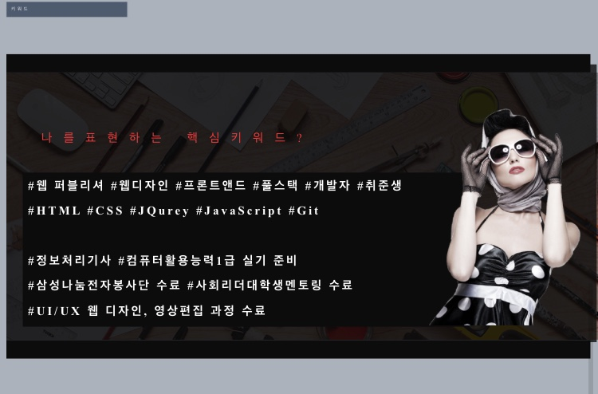
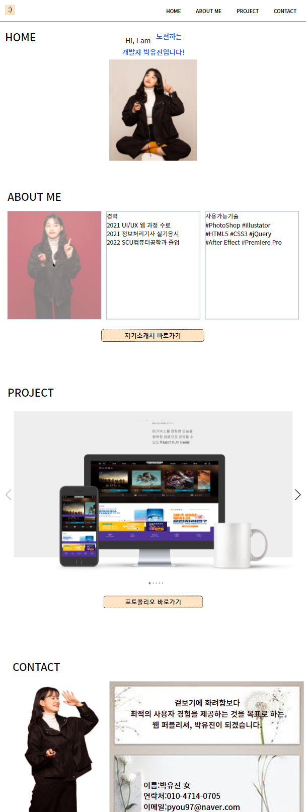
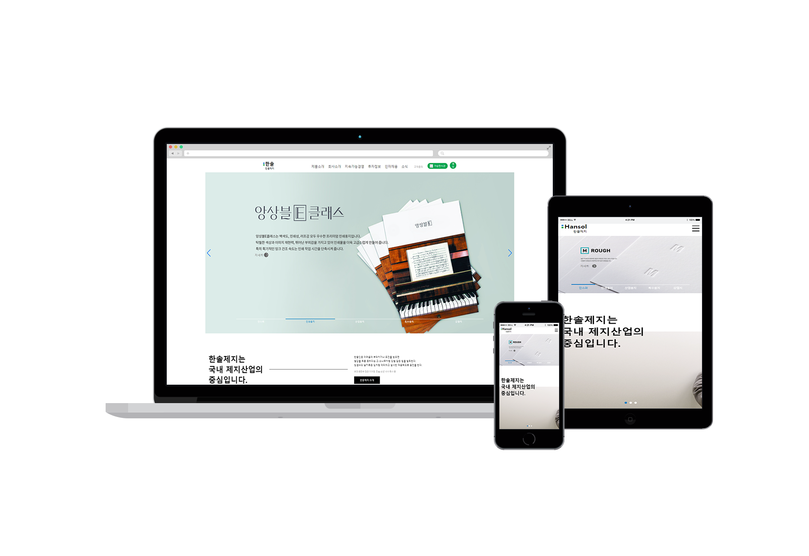
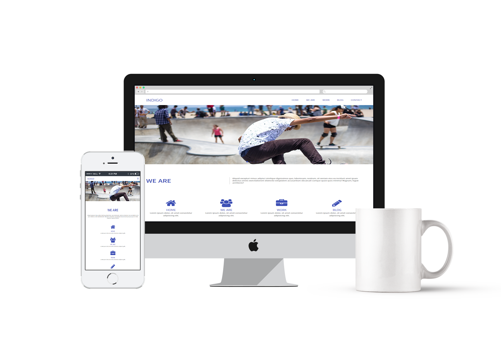

# 박유진의 포트폴리오에 오신것을 환영합니다.

## 보유자격 및 경력
* 운전면허 2종 보통
* 컴퓨터활용 능력 2급
* 심리상담사 1급
* 정보처리기사 실기응시

## 대내&외 활동 경험
* 의료공과대학 기자단 2년 활동
* 삼성나눔전자봉사단 6기 수료
* 사회리더대학생 멘토링 12기 활동
* 연희직업전문학교 UI/UX 웹디자인 과정 수료

## 사용가능기술
* HTML5, CSS3, JQuery, 스프링게시판 구현
* PothoShop, Illustrator, Premiere Pro, After Effect

## WORK FLOW
### 와이어프레임

https://user-images.githubusercontent.com/93187201/143182797-407184c1-ede3-4bff-aa42-f1fea0e53dc2.mp4
https://user-images.githubusercontent.com/93187201/143182806-f3007293-54ac-45f2-a807-bca6c00ac0fe.mp4

### 스토리보드

### 무드보드

### 키워드

## PORTFOLIO
[개인포트폴리오 ](https://rtt1006-portfolio.github.io/Project-2/)  
###  시안

### 데스크탑 시안

*

[메가박스](https://rtt1006-portfolio.github.io/Megabox/)  

[한솔](https://rtt1006-portfolio.github.io/Hansole/)  

[할리스](https://github.com/rtt1006-portfolio/Hollys)  

[인디고](https://rtt1006-portfolio.github.io/Indigo/)  

[투어리스트](https://rtt1006-portfolio.github.io/Tourist/)
